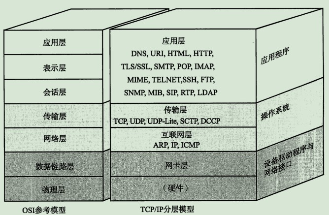

[TOC]

## 1. HTTP的前世今生

- HTTP 协议始于1989年蒂姆·伯纳斯 - 李的一篇论文
  - 确立了三项关键技术: URI, HTML, HTTP
  - 万维网(World Wide Web)
- HTTP/0.9 是个简单的文本协议，只能获取文本资源
  - 1990年 问世
  - 结构比较简单, 为了便于服务器和客户端处理, 它也采用了纯文本格式
  - 蒂姆·伯纳斯 - 李最初设想的系统里的文档都是只读的，所以只允许用“GET”动作从服务器上获取 HTML 文档，并且在响应请求之后立即关闭连接，功能非常有限
- HTTP/1.0 确立了大部分现在使用的技术，但它不是正式标准
  - 1996年 5月正式发布
  - HTTP/1.0 的RFC编号是1945, HTTP/0.9没有RFC
  - HTTP/1.0 并不是一个“标准”，只是记录已有实践和模式的一份参考文档，不具有实际的约束力，相当于一个“备忘录
  - 1.增加了 HEAD、POST 等新方法；
    2.增加了响应状态码，标记可能的错误原因；
    3.引入了协议版本号概念；(早期的HTTP/0.9没有版本号, 是之后加上去用于区分1.0/1.1)
    4.引入了 HTTP Header（头部）的概念，让 HTTP 处理请求和响应更加灵活；
    5.传输的数据不再仅限于文本
- HTTP/1.1 是目前互联网上使用最广泛的协议，功能也非常完善
  - 1997 年 1 月公布的 HTTP/1.1 是目前主流的 HTTP 协议版本.当初的标准是 RFC2068, 之后发布的修订版 RFC2616 就是当前的最新版本
  - 是一个“正式的标准”，而不是一份可有可无的“参考文档”
  - 1.增加了 PUT、DELETE 等新的方法；
    2.增加了缓存管理和控制；
    3.明确了连接管理，允许持久连接；
    4.允许响应数据分块（chunked），利于传输大文件；
    5.强制要求 Host 头，让互联网主机托管成为可能
- HTTP/2.0 基于 Google 的 SPDY 协议，注重性能改善，但还未普及
  - 2015 年发布HTTP/2，RFC 编号 7540
  - 1.二进制协议，不再是纯文本；
    2.可发起多个请求，废弃了 1.1 里的管道；
    3.使用专用算法压缩头部，减少数据传输量；
    4.允许服务器主动向客户端推送数据；
    5.增强了安全性,“事实上”要求加密通信
- HTTP/3.0 基于 Google 的 QUIC 协议，是将来的发展方向

## 2. HTTP是什么

### 2.1 超文本传输协议(HyperText Transfer Protocol)

HTTP 是一个在计算机世界里专门在两点之间传输文字、图片、音频、视频等超文本数据的约定和规范

- 协议
  - 第一点，协议必须要有两个或多个参与者，也就是“协”; 第二点，协议是对参与者的一种行为约定和规范，也就是“议”.
  - HTTP 是一个用在计算机世界里的协议，它确立了一种计算机之间交流通信的规范，以及相关的各种控制和错误处理方式
- 传输
  - HTTP 专门用来在两点之间传输数据，不能用于广播、寻址或路由
  - 第一点，HTTP 协议是一个“双向协议”,数据在 A 和 B 之间双向而不是单向流动;第二点，数据虽然是在 A 和 B 之间传输，但并没有限制只有 A 和 B 这两个角色，允许中间有“中转”或者“接力”;
- 超文本
  - “超越了普通文本的文本”,它是文字、图片、音频和视频等的混合体, 最关键的是含有“超链接”,能够从一个“超文本”跳跃到另一个“超文本”,形成复杂的非线性、网状的结构关系
  - 对于“超文本”，我们最熟悉的就应该是 HTML 了,它本身只是纯文字文件，但内部用很多标签定义了对图片、音频、视频等的链接，再经过浏览器的解释，呈现在我们面前的就是一个含有多种视听信息的页面
  - HTTP 传输的是文字、图片、音频、视频等超文本数据

HTTP 是构建互联网的重要基础技术，它没有实体，依赖许多其他的技术来实现，但同时许多技术也都依赖于它

### 2.2 HTTP 不是什么

(1) HTTP 不是互联网

互联网（Internet）是遍布于全球的许多网络互相连接而形成的一个巨大的国际网络，在它上面存放着各式各样的资源，也对应着各式各样的协议，例如超文本资源使用 HTTP，普通文件使用 FTP，电子邮件使用 SMTP 和 POP3 等. HTTP 是构建互联网的一块重要拼图，而且是占比最大的那一块

(2)HTTP 不是编程语言

编程语言是人与计算机沟通交流所使用的语言，而 HTTP 是计算机与计算机沟通交流的语言，我们无法使用 HTTP 来编程，但可以反过来，用编程语言去实现 HTTP，告诉计算机如何用 HTTP 来与外界通信
举例: 很多流行的编程语言都支持编写 HTTP 相关的服务或应用，例如使用 Java 在 Tomcat 里编写 Web 服务，
使用 PHP 在后端实现页面模板渲染，使用 JavaScript 在前端实现动态页面更新

HTTP 不是HTML: HTML 是超文本的载体，是一种标记语言，使用各种标签描述文字、图片、超链接等资源，并且可以嵌入 CSS、JavaScript 等技术实现复杂的动态效果

(3)HTTP 不是一个孤立的协议
	在互联网世界里，HTTP 通常跑在 TCP/IP 协议栈之上，依靠 IP 协议实现寻址和路由、TCP 协议实现可靠数据传输、DNS 协议实现域名查找、SSL/TLS 协议实现安全通信。此外，还有一些协议依赖于 HTTP，例如 WebSocket、HTTPDNS 等。这些协议相互交织，构成了一个协议网，而 HTTP 则处于中心地位

## 3. HTTP 世界全览

### 3.1 与 HTTP 相关的各种概念

(1)互联网(Internet)
	
我们通常使用的浏览器访问实际上是"万维网"(World Wide Web), 它只是互联网的一个子集，它基于 HTTP 协议，传输 HTML 等超文本资源，能力也就被限制在 HTTP 协议之内
	
互联网上还有许多万维网之外的资源，例如常用的电子邮件、BT 和 Magnet 点对点下载、FTP 文件下载、SSH 安全登录、各种即时通信服务等等，它们需要用各自的专有协议来访问
	
HTTP 协议非常灵活、易于扩展，而且“超文本”的表述能力很强，所以很多其他原本不属于 HTTP 的资源也可以“包装”成 HTTP 来访问, 如各种XX应用网页版(微信网页版, 邮箱网页版)

(2)浏览器(Web Browser)

检索、查看互联网上网页资源的应用程序

Web 指万维网

浏览器本质上是一个 HTTP 协议中的请求方，使用 HTTP 协议获取网络上的各种资源

在 HTTP 协议里，浏览器的角色被称为“User Agent”即“用户代理”，意思是作为访问者的“代理”来发起 HTTP 请求, 通常简称"客户端"

浏览器集成的功能: HTML 排版引擎用来展示页面，JavaScript 引擎用来实现动态化效果, 开发者工具用来调试网页，以及五花八门的各种插件和扩展

(3)Web 服务器(Web Server)

浏览器是 HTTP 里的请求方，在协议另一端的应答方(响应方) : 服务端

HTTP 协议里响应请求的主体

包含硬件和软件:

- 硬件: 物理形式或“云”形式的机器，在大多数情况下它可能不是一台服务器，而是利用反向代理、负载均衡等技术组成的庞大集群

- 软件: 提供 Web 服务的应用程序，通常会运行在硬件含义的服务器上. 它利用强大的硬件能力响应海量的客户端 HTTP 请求, 处理磁盘上的网页、图片等静态文件，或者把请求转发给后面的 Tomcat、Node.js 等业务应用，返回动态的信息

Web 服务器举例: 常用的有 Apache 和 Nginx, 另外Windows 上的 IIS、Java 的 Jetty/Tomcat

(4)CDN (Content Delivery Network)

CDN 位于浏览器和服务器之间，主要起到缓存加速的作用

应用了 HTTP 协议里的缓存和代理技术，代替源站响应客户端的请求

缓存源站的数据，让浏览器的请求不用“千里迢迢”地到达源站服务器，直接在“半路”就可以获取响应. 如果 CDN 的调度算法很优秀，更可以找到离用户最近的节点，大幅度缩短响应时间

CDN能利用缓存加速网络, 还能提供负载均衡、安全防护、边缘计算、跨运营商网络等功能

CDN，实际上就是一种代理，它代替源站服务器响应客户端的请求，通常扮演着透明代理和反向代理的角色

(5)爬虫

爬虫是另一类 User Agent，是自动访问网络资源的程序

据估计，互联网上至少有 50% 的流量都是由爬虫产生的，某些特定领域的比例还会更高

绝大多数是由各大搜索引擎“放”出来的，抓取网页存入庞大的数据库，再建立关键字索引，这样我们才能够在搜索引擎中快速地搜索到互联网角落里的页面

爬虫也有不好的一面，它会过度消耗网络资源，占用服务器和带宽，影响网站对真实数据的分析，甚至导致敏感信息泄漏, 所以出现了“反爬虫”技术，通过各种手段来限制爬虫。如“君子协定”robots.txt，约定哪些该爬，哪些不该爬

爬虫 和 反爬虫 技术, 用到的基本技术都是 HTTP 和 HTML

(6)HTML

HTML 是 HTTP 协议传输的主要内容之一，它描述了超文本页面，用各种“标签”定义文字、图片等资源和排版布局，最终由浏览器“渲染”出可视化页面

(7)WebService

Web  Service 是一种由 W3C 定义的应用服务开发规范，使用 client-server 主从架构，通常使用 WSDL 定义服务接口，使用 HTTP 协议传输 XML 或 SOAP 消息，也就是说，它是一个基于 Web（HTTP）的服务架构技术，既可以运行在内网，也可以在适当保护后运行在外网

(8)WAF

网络应用防火墙, 应用层面的“防火墙”，专门检测 HTTP 流量，是防护 Web 应用的安全技术

WAF 通常位于 Web 服务器之前，可以阻止如 SQL 注入、跨站脚本等攻击，目前应用较多的一个开源项目是 ModSecurity，它能够完全集成进 Apache 或 Nginx

### 3.2 与 HTTP 相关的各种协议

(1)TCP/IP

TCP/IP 是网络世界最常用的协议，HTTP 通常运行在 TCP/IP 提供的可靠传输基础上

TCP 属于“传输层”，IP 属于“网际层”

IP(Internet Protocol)
- 主要目的是解决寻址和路由问题，以及如何在两点间传送数据包
- IP 协议使用“IP 地址”的概念来定位互联网上的每一台计算机
- v4 版, 地址是四个用“.”分隔的数字, 总共有 2^32, 大约 42 亿个可以分配的地址;
- v6 版, 使用 8 组“:”分隔的数字作为地址，容量扩大了很多，有 2^128 个;
	

TCP(Transmission Control Protocol)
- 传输控制协议, 位于 IP 协议之上，基于 IP 协议提供可靠的、字节流形式的通信
        “可靠”是指保证数据不丢失，“字节流”是指保证数据完整

(2)DNS(Domain Name System)

域名系统

DNS 域名是 IP 地址的等价替代，需要用域名解析实现到 IP 地址的映射

域名用“.”分隔成多个单词，级别从左到右逐级升高，最右边的被称为“顶级域名”

要使用 TCP/IP 协议来通信仍然要使用 IP 地址，所以需要把域名做一个转换，“映射”到它的真实 IP，这就是所谓的“域名解析”

(3)URI/URL

URI 是用来标记互联网上资源的一个名字，由“协议名 + 主机名 + 路径”构成，俗称 URL

URI(Uniform Resource Identifier)
- 统一资源标识符, 使用它就能够唯一地标记互联网上资源
- URI 主要有三个基本的部分构成:(以Nginx网站为例 http://nginx.org/en/download.html)
    - 1.协议名：即访问该资源应当使用的协议，在这里是“http”；
    - 2.主机名：即互联网上主机的标记，可以是域名或 IP 地址，在这里是“nginx.org”；
    - 3.路径：即资源在主机上的位置，使用“/”分隔多级目录，在这里是“/en/download.html

URL(Uniform Resource Locator)
- 统一资源定位符, 也就是我们俗称的“网址”，它实际上是 URI 的一个子集
- URI 用字符串标识某一互联网资源，而 URL 表示资源的地点（互联网上所处的位置）

(4)HTTPS(HTTP over SSL/TLS)
HTTPS 相当于“HTTP+SSL/TLS+TCP/IP”，为 HTTP 套了一个安全的外壳

SSL 的全称是“Secure Socket Layer”，由网景公司发明，当发展到 3.0 时被标准化，改名为 TLS，即“Transport Layer Security”，但由于历史的原因还是有很多人称之为 SSL/TLS，或者直接简称为 SSL

SSL 使用了许多密码学最先进的研究成果，综合了对称加密、非对称加密、摘要算法、数字签名、数字证书等技术，能够在不安全的环境中为通信的双方创建出一个秘密的、安全的传输通道

(5)代理(Proxy)

代理是 HTTP 传输过程中的“中转站”，可以实现缓存加速、负载均衡等功能

代理有很多的种类，常见的有：
- 1.匿名代理：完全“隐匿”了被代理的机器，外界看到的只是代理服务器；
- 2.透明代理：顾名思义，它在传输过程中是“透明开放”的，外界既知道代理，也知道客户端；
- 3.正向代理：靠近客户端，代表客户端向服务器发送请求；
- 4.反向代理：靠近服务器端，代表服务器响应客户端的请求；

CDN，实际上就是一种代理，它代替源站服务器响应客户端的请求，通常扮演着透明代理和反向代理的角色

代理环节可以做的事:
- 1.负载均衡：把访问请求均匀分散到多台机器，实现访问集群化；
- 2.内容缓存：暂存上下行的数据，减轻后端的压力；
- 3.安全防护：隐匿 IP, 使用 WAF 等工具抵御网络攻击，保护被代理的机器；
- 4.数据处理：提供压缩、加密等额外的功能。

## 4. 网络协议分层

(1)TCP/IP与OSI 参考模型(截取自《图解TCP/IP 协议.第5版》)

(2)TCP/IP与OSI 参考模型(截取自极客时间)

(3)TCP/IP 网络分层模型

1.link layer(链接层)

2.internet layer(网际层或网络互连层)

3.transport layer(传输层)

4.application layer(应用层)

MAC 层的传输单位是帧(frame)

IP 层的传输单位是包(packet)

TCP 层的传输单位是段(segment)

HTTP 的传输单位则是消息或报文(message)

都可统称为 数据包

(4)OSI 网络分层模型

开放式系统互联通信参考模型(Open System Interconnection Reference Model)

1.physical layer(物理层)，网络的物理形式，例如电缆、光纤、网卡、集线器等等；

2.data link layer(数据链路层)，它基本相当于 TCP/IP 的链接层；

3.network layer(网络层)，相当于 TCP/IP 里的网际层；

4.transport layer(传输层)，相当于 TCP/IP 里的传输层；

5.session layer(会话层)，维护网络中的连接状态，即保持会话和同步；

6.presentation layer(表示层)，把数据转换为合适、可理解的语法和语义；

7.application layer(应用层)，面向具体的应用传输数据

## 5. 域名

域名

DNS

不怀好意的 DNS
- “域名屏蔽”，对域名直接不解析，返回错误，让你无法拿到 IP 地址，也就无法访问网站；
- “域名劫持”，也叫“域名污染”，你要访问 A 网站，但 DNS 给了你 B 网站。

域名的解析
- 浏览器缓存->操作系统缓存->hosts->dns